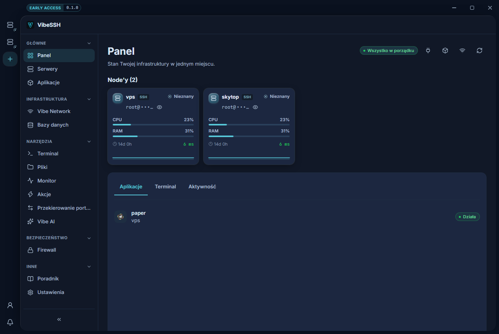
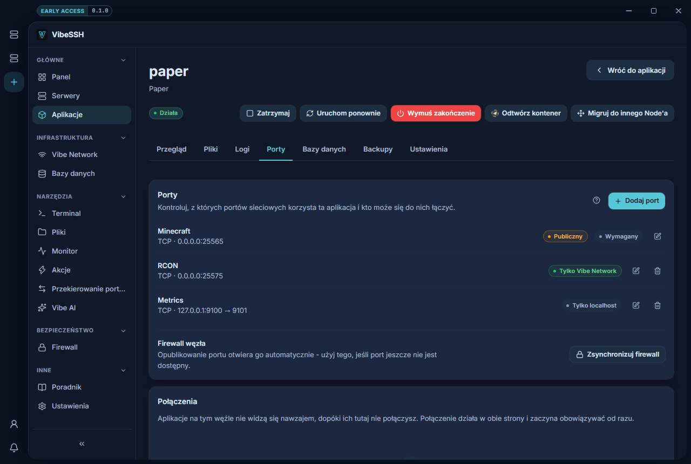

<div align="center">

# VibeSSH

**Twoje serwery z Linuksem w jednej aplikacji na komputer.**

Terminal, pliki, monitoring, aplikacje w Dockerze, prywatna sieć między
maszynami i firewall — bez panelu w przeglądarce i bez instalowania czegokolwiek
na serwerze, żeby zacząć.

[](LICENSE.txt)
[](https://github.com/VibeSSH/vibessh-releases/releases/latest)
[](https://vibessh.dev)

[English](README.md) · [Polski](README.pl.md)



</div>

---

## Co to jest

VibeSSH to aplikacja na komputer (Windows i Linux) dla osób, które mają kilka
serwerów z Linuksem i wolałyby nie trzymać otwartych czterech różnych narzędzi,
żeby nimi zarządzać. Robi to, co Termius, WinSCP, `htop` i mały panel
hostingowy — każde z osobna — robią po kawałku.

Łączy się na jeden z dwóch sposobów i możesz to później zmienić:

- **Tryb SSH** — zwykłe SSH i SFTP. Na serwerze nie instaluje się nic. Jeśli
  możesz się już na maszynę dostać przez `ssh`, VibeSSH nią zarządzi.
- **Tryb agenta** — opcjonalny demon `vibe-agent` na serwerze dokłada
  metryki na żywo, strumieniowane logi i pełniejszy terminal.

Interfejs nigdy nie wie, z którym trybem rozmawia; oba stoją za tym samym
interfejsem po stronie Rusta.

## Co potrafi

| | |
| --- | --- |
| **Terminal** | Wiele interaktywnych sesji SSH w kartach |
| **Pliki** | Menedżer plików po SFTP, z edytorem i wysyłaniem/pobieraniem |
| **Monitor** | Procesor, pamięć, dysk i sieć, procesy, usługi systemd, kontenery Dockera, otwarte porty |
| **Akcje** | Uruchamianie, zatrzymywanie, restart, włączanie i wyłączanie usług i kontenerów jednym kliknięciem |
| **Aplikacje** | Kontenery Dockera z szablonu, z własnymi plikami, konsolą, logami, portami, zmiennymi, bazami danych i kopiami zapasowymi — w tym Minecraft (Paper, Purpur, Velocity, Waterfall) |
| **Vibe Network** | Sieć WireGuard między Twoimi serwerami, z prywatnym DNS-em, dzięki czemu dosięgają się nawzajem bez wychodzenia do publicznego internetu |
| **Vibe Firewall** | Reguły wyprowadzone z tego, co faktycznie opublikowałeś, przy czym SSH zawsze zostaje osiągalne |
| **Konta i zespoły** | Opcjonalnie: współdzielone serwery, role i uprawnienia oraz dziennik zdarzeń |

<div align="center">



*Każdy port mówi, czy naprawdę jest chroniony, a nie tylko o co poprosiłeś.*

</div>

## Od czego zacząć

Pobierz instalator dla swojego systemu z
[najnowszego wydania](https://github.com/VibeSSH/vibessh-releases/releases/latest),
dodaj serwer, a aplikacja sama zaproponuje doinstalowanie tego, czego temu
serwerowi brakuje.

Zwykłe SSH, terminal i menedżer plików działają na każdej maszynie z Linuksem,
na którą już się dostajesz przez `ssh`. Aplikacje, Vibe Network i Vibe Firewall
wymagają na serwerze trzech rzeczy:

- [Docker](https://docs.docker.com/engine/install/) — uruchamia każdą aplikację jako kontener
- [WireGuard](https://www.wireguard.com/install/) — prywatna sieć między serwerami
- [ufw](https://help.ubuntu.com/community/UFW) — to, na czym opiera się firewall

Żadnego z nich nie musisz instalować ręcznie. Strona konfiguracji — ikona
koła zębatego na karcie serwera, otwierana sama zaraz po dodaniu serwera —
wykrywa, czego brakuje, i proponuje instalację po tym samym połączeniu SSH.
Stamtąd proponuje też sparowanie agenta i włączenie firewalla. Zanim
cokolwiek zostanie zastosowane, zawsze widzisz dokładny zestaw reguł.

W aplikacji jest poradnik krok po kroku, ten sam co na
[vibessh.dev](https://vibessh.dev).

## Budowanie ze źródeł

Potrzebujesz [Buna](https://bun.com) 1.2+ i stabilnego łańcucha narzędzi
[Rusta](https://rustup.rs). Na Windowsie dodatkowo środowiska
[WebView2](https://developer.microsoft.com/microsoft-edge/webview2/) (jest już
w aktualnych Windows 10 i 11) oraz narzędzi MSVC
(`winget install Microsoft.VisualStudio.2022.BuildTools`, z obciążeniem C++) —
wymaga ich Rust, nie akurat ten projekt.

```bash
bun install
bun run tauri dev
```

`./scripts/setup.ps1` robi to samo, sprawdzając najpierw wymagania;
`-Dev` uruchamia aplikację, a `-Build` tworzy instalator dla Windowsa.

Żeby uruchomić samego agenta, bez aplikacji:

```bash
cargo run -p vibe-agent                          # start, Ctrl+C żeby zatrzymać
cargo run -p vibe-agent -- pair VIBE-XXXX-XXXX   # w drugim terminalu, gdy masz już kod
```

Zwykle nie są potrzebne: strona Serwery generuje i zużywa kody parowania za
Ciebie.

## Jak ułożone jest repozytorium

```
apps/desktop/     aplikacja na komputer - ui/ to React, src-tauri/ to Rust
apps/agent/       opcjonalny demon po stronie serwera
apps/backend/     usługa kont, zespołów i uprawnień
crates/protocol/  format wymiany wspólny dla aplikacji i agenta
shared/guide/     poradnik w aplikacji - wejście do budowania, nie dokumentacja o budowaniu
docs/             notatki o architekturze, bezpieczeństwie i planach
scripts/          skrypty konfiguracyjne i utrzymaniowe
```

[`docs/repository-structure.md`](docs/repository-structure.md) wyjaśnia,
dlaczego jest ułożone właśnie tak i co gdzie należy.

## Współtworzenie

Zgłoszenia i pull requesty są mile widziane. Warto wiedzieć, zanim zaczniesz:

- `bun run test`, `cargo test --workspace` i
  `cargo clippy --workspace --all-targets -- -D warnings` to jest to, co
  uruchamia CI; puszczenie ich u siebie oszczędza jedną rundę.
- Wszystko, co użytkownik może przeczytać, musi istnieć po angielsku i po
  polsku. Są testy, które nie przechodzą, gdy brakuje jednej wersji.
- Opisy commitów tłumaczą tutaj, *dlaczego* zmiana powstała, zamiast
  powtarzać, co zmieniła.

## Bezpieczeństwo

Jeśli znajdziesz podatność, zgłoś ją proszę prywatnie przez
[formularz GitHuba](https://github.com/VibeSSH/vibessh/security/advisories/new),
a nie przez publiczne zgłoszenie.

## Licencja

[AGPL-3.0-or-later](LICENSE.txt).
