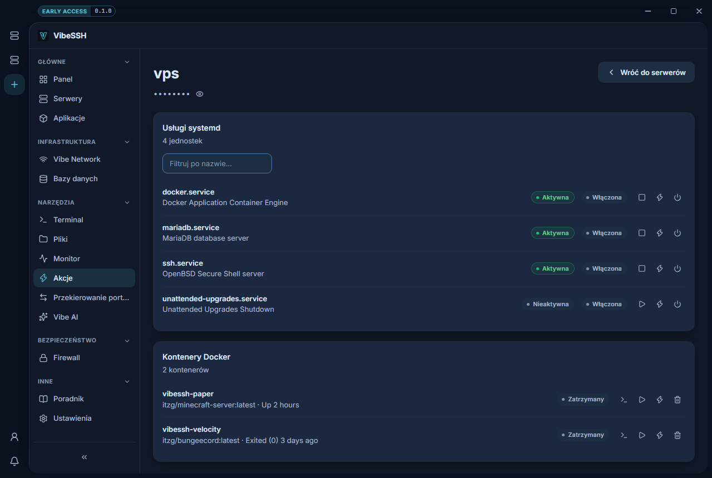

Actions lets you manage a server's system services and containers - the ones you did not create as applications in VibeSSH.

## How to open it

1. Open **Actions** in the sidebar.
2. Choose a server.

## How to manage a service

1. Find the service in the **systemd services** list. Use **Filter by name**.
2. Click an action icon on the service: start, stop, restart.
3. To make it come back after a reboot, use the enable action.

## Two independent states

| State | What it means |
| --- | --- |
| **Active** / **Inactive** | Whether it is running right now. |
| **Enabled** / **Disabled** | Whether it comes back after a reboot. |

A service can be running and not enabled - it disappears when the server reboots.

## Docker containers

The **Docker containers** section lists the server's containers. You can start, stop, restart and view their logs.

Applications created in VibeSSH are managed in the **Applications** module, not here.

## How to check it works

- The service changes to **Active**.
- The container changes to running.

## Common problems

- **No containers** - the server has no Docker, or the account cannot reach it.
- **The service runs but is gone after a reboot** - it was active but not enabled.
- **I cannot stop a service** - the account has no `sudo`.

## More detail

Stopping a service also stops everything that depends on it. Do not stop the `ssh` service - you will lose access to the server from VibeSSH.
