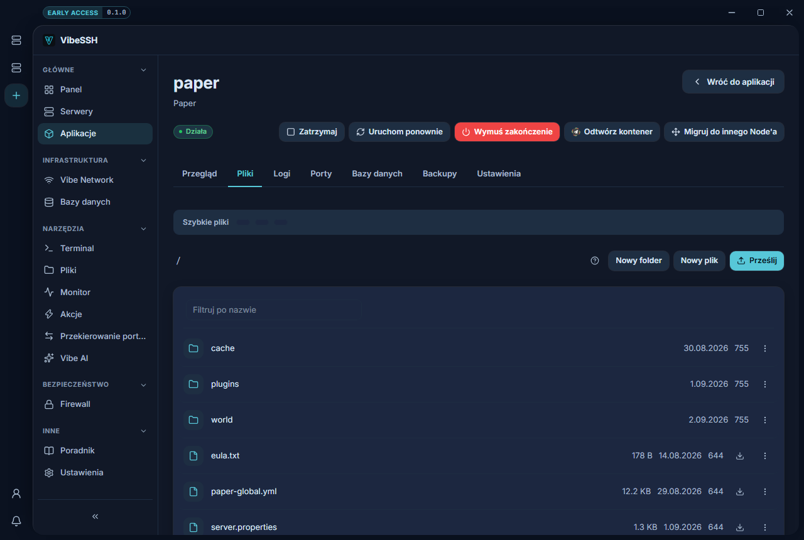

Zakładka **Pliki** pokazuje pliki aplikacji: konfigurację, wtyczki, świat.

## Jak przeglądać

1. Otwórz aplikację → zakładka **Pliki**.
2. Kliknij folder, żeby wejść do środka.
3. Kliknij nazwę nad listą, żeby wrócić wyżej.
4. Użyj pola **Filtruj**, żeby znaleźć plik po nazwie.

## Jak edytować plik

1. Kliknij nazwę pliku.
2. Wprowadź zmiany.
3. Kliknij **Zapisz** albo wciśnij `Ctrl+S`.
4. Zrestartuj aplikację przyciskiem **Uruchom ponownie**.

Zaznaczona opcja **Kopia zapasowa przed zapisem** zapisuje poprzednią wersję. Znajdziesz ją pod ikoną historii.

Aby znaleźć tekst w pliku, kliknij ikonę lupy albo wciśnij `Ctrl+F`.

## Jak przesłać plik

1. Kliknij **Prześlij**.
2. Wybierz plik z komputera.
3. Poczekaj na koniec transferu.

## Jak pobrać plik

1. Kliknij ikonę pobierania przy pliku.
2. Wskaż miejsce zapisu.

## Pozostałe operacje

Kliknij plik prawym przyciskiem myszy:

- **Zmień nazwę**
- **Przenieś**
- **Kopiuj**
- **Uprawnienia**
- **Usuń**
- **Rozpakuj** — dla plików `.zip`

Nowe pliki i foldery tworzysz przyciskami **Nowy plik** i **Nowy folder**.

## Jak sprawdzić, czy działa

- Po zapisie pojawia się komunikat o zapisaniu pliku.
- Po restarcie aplikacja używa nowej konfiguracji.
- Przesłany plik jest widoczny na liście.

## Najczęstsze problemy

- **Nie mogę zapisać pliku YAML** — nad edytorem jest czerwony pasek z numerem linii. Popraw błąd, wtedy zapis się odblokuje.
- **Nie widzę pliku wgranego inaczej niż przez VibeSSH** — wejdź do folderu ponownie, żeby odświeżyć listę.
- **Plik się nie otwiera** — pliki powyżej 1 MB nie otwierają się w edytorze. Pobierz go.

## Więcej informacji

Zapis pliku `.yml` jest blokowany przy błędzie składni, bo taki plik zatrzymałby serwer przy starcie. Ostrzeżenia nie blokują. Lista pokazuje maksymalnie 200 pozycji — w większym folderze użyj pola **Filtruj**.
