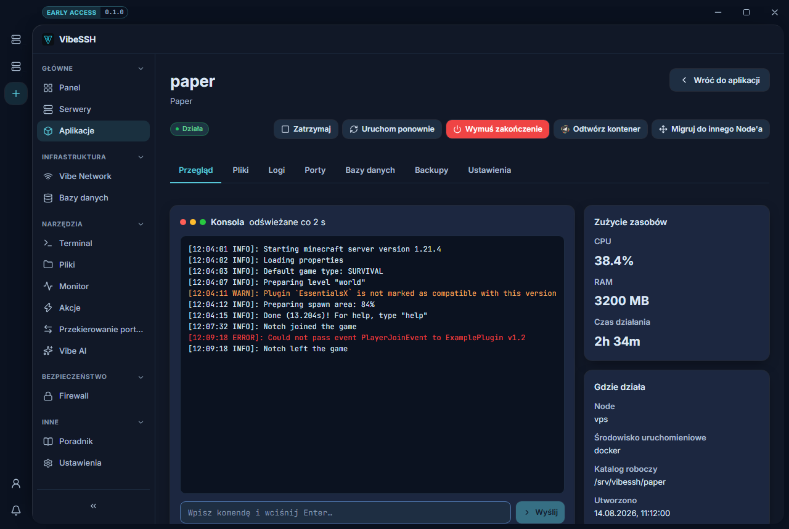

Aplikacja to jedna rzecz działająca na Node: serwer Minecraft, proxy, bot, baza.

## Jak utworzyć aplikację

1. Otwórz **Aplikacje**.
2. Kliknij **Utwórz aplikację**.
3. **Krok 1 — Lokalizacja i podstawy**: w polu **Gdzie ma działać?** wybierz Node albo ten komputer. Wpisz **Nazwę** i **Katalog roboczy**, np. `/srv/paper`. Nad tymi polami jest lista **Szablony** — wybranie szablonu wypełnia resztę kreatora za Ciebie.
4. **Krok 2 — Rodzaj aplikacji**: wybierz, co to ma być (Paper, MariaDB, phpMyAdmin…) i **Runtime**.
5. **Krok 3 — Konfiguracja**: pola zależą od rodzaju — wersja serwera, wersja Javy, plik startowy. phpMyAdmin ma tu dodatkowo pole **Baza danych**.
6. **Krok 4 — Zmienne środowiskowe**: szablon wpisuje tu nazwy zmiennych, których wymaga dany obraz. Możesz też pominąć i dodać je później.
7. **Krok 5 — Podsumowanie**: sprawdź dane i zatwierdź.
8. Na stronie aplikacji kliknij **Uruchom**.

Kreator nie ustawia RAM-u ani portów. Robisz to po utworzeniu, w zakładkach **Ustawienia** i **Porty**.

Nie wiesz, co wpisać w konkretnym polu? Na stronie aplikacji, obok nazwy jej rodzaju, jest znak zapytania — otwiera instrukcję krok po kroku właśnie dla tego rodzaju: co ustawić, jak się połączyć i co robić, kiedy nie działa.

## Szablony

Szablon to zapamiętane odpowiedzi kreatora: rodzaj aplikacji, jego ustawienia i zmienne środowiskowe. Nie zapamiętuje lokalizacji, bo to akurat zwykle za każdym razem jest inne.

VibeSSH ma kilka szablonów wbudowanych — **MariaDB z hasłem roota**, **phpMyAdmin do aplikacji MariaDB**, **phpMyAdmin do dowolnego serwera**. Wpisują nazwy zmiennych, bez których dany obraz nie wystartuje albo nie połączy się z niczym. Wbudowanych nie da się usunąć ani nadpisać.

Własny szablon zapisujesz na ostatnim kroku kreatora, przyciskiem **Zapisz jako szablon**. Hasła i klucze **nie są zapisywane** — zostaje sama nazwa zmiennej, a wartość kreator pyta za każdym razem.

## Połączenia między aplikacjami

Aplikacje na jednym Node **nie widzą się nawzajem**, dopóki im na to nie pozwolisz. To celowe: przejęcie jednej nie daje wtedy dostępu do pozostałych.

1. Otwórz aplikację → zakładka **Porty** → karta **Połączenia**.
2. Wybierz drugą aplikację i kliknij **Połącz**.

Połączenie działa w obie strony. Od tej pory jedna aplikacja widzi drugą pod jej **nazwą zapisaną małymi literami**, ze spacjami zamienionymi na myślniki — `Moja Baza` to `moja-baza`. Portem jest ten, na którym program nasłuchuje w kontenerze, a nie ten opublikowany na zewnątrz.

To najczęstszy powód, dla którego „wszystko jest dobrze ustawione, a nie łączy": brakuje tu wpisu.

## Zmiana rodzaju aplikacji

**Ustawienia → Typ aplikacji** pozwala przełączyć istniejącą aplikację na inny rodzaj — w obie strony.

- **Na rodzaj zarządzany** (Paper, Purpur, Velocity, Waterfall): VibeSSH pobierze wtedy własny plik serwera do katalogu aplikacji i od tej pory pilnuje wersji. Twoje światy, wtyczki i konfiguracje zostają nietknięte, ale serwer wystartuje z pobranego pliku. Najpierw go zatrzymaj.
- **Na zwykły kontener Docker**: nic w katalogu nie zostaje pobrane, podmienione ani usunięte. Zmienia się tylko sposób uruchamiania.

Ostrzeżenie nad przyciskiem mówi, który z tych dwóch przypadków właśnie wybierasz.

## Przejęcie istniejących serwerów

Jeśli na maszynie leżą już serwery — po panelu Pterodactyl, po ręcznej instalacji, z kopii zapasowej — nie trzeba ich stawiać od nowa.

1. Otwórz **Aplikacje** i kliknij **Przejmij serwery**.
2. Wybierz lokalizację i katalog, w którym leżą (na hoście Pterodactyla zwykle `/home/container`).
3. Kliknij **Skanuj**. VibeSSH wypisze znalezione serwery razem z ich plikiem `.jar` i portem z `server.properties`.
4. Odznacz te, których nie chcesz, wybierz wersję Javy i kliknij **Przejmij**.

Powstają zwykłe kontenery Docker wskazane na istniejące katalogi. Nic nie jest pobierane ani podmieniane — świadomie, żeby przejęcie nie nadpisało działającego serwera. Jeśli potem chcesz, żeby VibeSSH zarządzał wersją, użyj **Zmiany rodzaju aplikacji** opisanej wyżej.

## Sterowanie aplikacją

Przyciski na górze strony aplikacji:

| Przycisk | Co robi |
| --- | --- |
| **Uruchom** | Startuje aplikację. |
| **Zatrzymaj** | Zatrzymuje w sposób kontrolowany. |
| **Uruchom ponownie** | Zatrzymuje i uruchamia. |
| **Wymuś zakończenie** | Ubija natychmiast. Serwer nie zapisze świata. |
| **Odtwórz kontener** | Buduje kontener od nowa. Nie kasuje plików aplikacji. |
| **Migruj do innego Node'a** | Przenosi aplikację razem z danymi. |

## Konsola

Konsola jest w zakładce **Przegląd**.

1. Wpisz komendę w polu na dole.
2. Wciśnij Enter albo kliknij **Wyślij**.

Ostrzeżenia są pomarańczowe, błędy czerwone.

## Ustawienie RAM-u i CPU

1. Wejdź w zakładkę **Ustawienia**.
2. Znajdź kartę **Limity zasobów** i kliknij **Edytuj**.
3. **Pamięć** — wpisz w MB, np. `2048`. Puste pole oznacza brak limitu.
4. **CPU** — wpisz liczbę rdzeni, np. `1.5`.
5. Zapisz.

## Zmienne środowiskowe

1. Wejdź w zakładkę **Ustawienia**.
2. Kliknij **Dodaj zmienną**.
3. Wpisz **Klucz** i **Wartość**.
4. Dla haseł i kluczy API zaznacz **Sekret**.
5. Zapisz.

## Jak sprawdzić, czy działa

- Status aplikacji to **Działa**.
- W konsoli pojawiają się nowe linie.
- Karta **Zużycie zasobów** pokazuje CPU i RAM.

## Najczęstsze problemy

- **Zmieniłem konfigurację i nic się nie stało** — jeśli aplikacja była zatrzymana, zmiana zadziała przy starcie.
- **Konsola jest pusta** — aplikacja nie działa albo kontener został właśnie odtworzony.
- **Aplikacja nie startuje** — otwórz zakładkę **Logi** i przeczytaj ostatnie linie.

## Więcej informacji

Docker zapisuje porty, limity, zmienne i obraz w kontenerze w chwili jego tworzenia. Dlatego zmiana któregokolwiek z nich na działającej aplikacji odtwarza kontener automatycznie. Dane aplikacji leżą w katalogu roboczym poza kontenerem i nie są przy tym ruszane.
