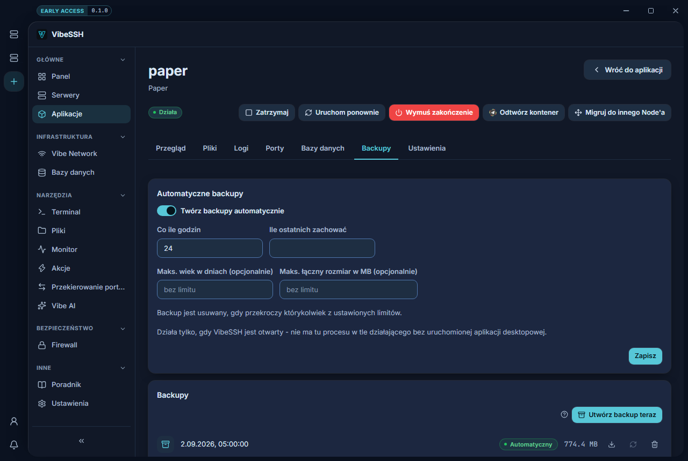

A backup is a copy of an application's files: the world, the configuration and the plugins.

## How to make a backup

1. Open the application -> the **Backups** tab.
2. Click **Back up now**.
3. Wait for the backup to appear in the list.

The most trustworthy backup is taken while the application is stopped.

## How to turn on automatic backups

1. On the **Backups** tab find the **Automatic backups** card.
2. Tick **Back up automatically**.
3. **Every N hours** - e.g. `24`.
4. **Keep the last N** - e.g. `7`.
5. **Max age in days** - optional, e.g. `30`.
6. **Max total size in MB** - optional, e.g. `20480`.
7. Save.

A backup is removed once it exceeds any one of the limits you set.

## How to restore a backup

1. Stop the application with **Stop**.
2. Open the **Backups** tab.
3. Click the restore icon on the backup you want.
4. Confirm.
5. Start the application with **Start**.

Restoring overwrites the current files and cannot be undone. The button is disabled while the application is running.

## How to download a backup

1. Click the download icon on the backup.
2. Choose where to save it.

## How to check it works

- The backup is in the list with its date and size.
- It is marked **Manual** or **Scheduled**.
- Once uploaded it reads **Uploaded to external storage (S3)**.

## Common problems

- **The schedule is set but there are no backups** - automatic backups only run while VibeSSH is open.
- **Backups take a lot of space** - a Minecraft world grows. Set **Max total size in MB**.
- **A backup loads the server** - packing a large world uses disk and CPU. Do it outside busy hours.

## More detail

A backup covers the application's working directory, not the contents of databases. The external destination (S3) is configured in **Settings -> Backup destination**. A backup kept only on the same Node as the application does not protect you from losing that server.
