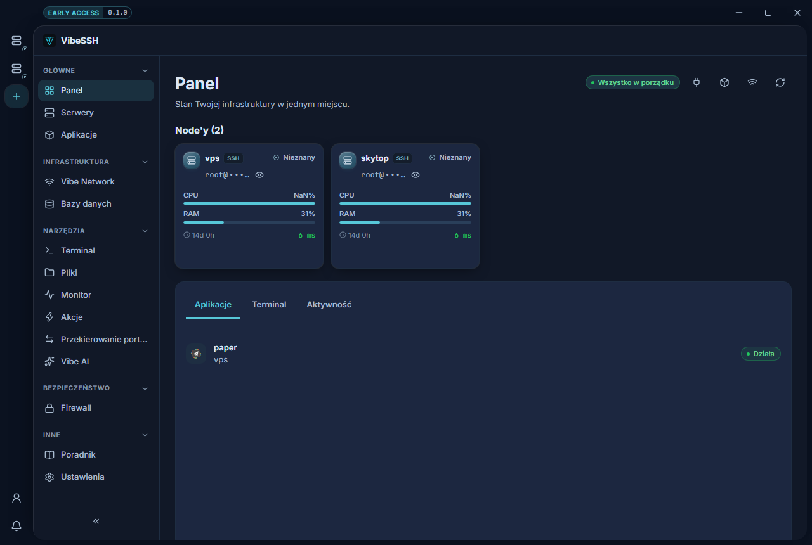

Panel to jedno pytanie: czy coś wymaga mojej uwagi. Jeśli nie, wchodzisz tu na sekundę i wychodzisz.

## Nagłówek

Zbiorczy stan całości: **Wszystko w porządku** albo **Wymaga uwagi**, i ile węzłów jest online. To wypadkowa alertów niżej, więc jeśli świeci ostrzegawczo, powód jest na tej samej stronie.

## Node'y

Kafelek na węzeł, a na nim CPU, RAM, czas pracy i stan synchronizacji z Vibe Network.

- **Zsynchronizowany** — konfiguracja na węźle odpowiada tej zadeklarowanej w aplikacji.
- **Niezsynchronizowany** — coś się rozjechało. Kliknięcie **Synchronizuj** doprowadza ten jeden węzeł do stanu docelowego.
- **Zbieranie danych…** — węzeł odpowiada, ale nie ma jeszcze pierwszej próbki metryk. Procent CPU to różnica między dwoma odczytami, więc pierwszy z nich nie ma z czym się porównać.
- **Offline** — węzeł nie odpowiedział.

## Alerty

Rzeczy, o których warto wiedzieć bez szukania: serwer offline, węzeł nieosiągalny w Vibe Network, aplikacja w stanie błędu. Pusta lista to prawdziwa informacja, nie brak danych.

## Zadania

Zaległości, które da się wykonać jednym kliknięciem — najczęściej węzeł czekający na synchronizację. Sekcja pokazuje się tylko wtedy, gdy jest w niej cokolwiek.

## Zakładki pod spodem

Po wybraniu węzła kafelkiem:

- **Aplikacje** — co na nim stoi.
- **Terminal** — powłoka do tego węzła bez przechodzenia do modułu Terminal. Dostępne tylko dla węzłów SSH.
- **Aktywność** — ostatnie zdarzenia. Węzły w trybie Agent nie mają metryk CPU i RAM, tylko stan synchronizacji.

**Wszystkie Node'y** czyści wybór i wraca do widoku zbiorczego.

## Jak często to się odświeża

Metryki węzłów co kilka sekund, całość panelu rzadziej. Odświeżanie zatrzymuje się, gdy okno jest schowane, i rusza od razu po powrocie — każdy odczyt to połączenie SSH do węzła, a nie darmowe zapytanie.

## Częste pomyłki

- **Panel pokazuje offline, a serwer działa** — sprawdź, czy VibeSSH ma do niego dostęp po SSH. Panel mówi o tym, co udało mu się osiągnąć, a nie o tym, czy maszyna żyje.
- **Metryki stoją w miejscu** — jeśli okno było schowane, ostatni odczyt jest sprzed jego ukrycia.
