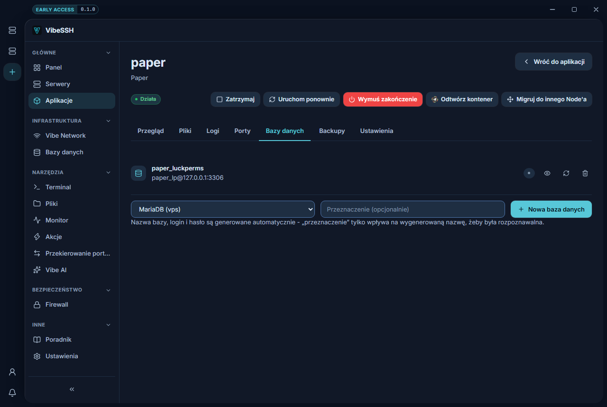

VibeSSH tworzy bazy MySQL/MariaDB dla aplikacji i pilnuje ich danych dostępowych.

## Jak dodać host bazy danych

Host to serwer bazy, na którym powstaną bazy. Trzeba go dodać raz.

1. Otwórz **Bazy danych** w menu bocznym.
2. Kliknij **Dodaj host**.
3. Wpisz adres, port i konto administracyjne serwera bazy.
4. Zapisz.

Jeśli na Node nie ma jeszcze żadnego silnika bazy, kliknij **Zainstaluj MariaDB** i poczekaj na zakończenie.

## Jak utworzyć bazę dla aplikacji

1. Otwórz aplikację → zakładka **Bazy danych**.
2. W polu wyboru wskaż host bazy.
3. **Przeznaczenie** — opcjonalnie, np. `luckperms`.
4. Kliknij **Nowa baza danych**.

Nazwa bazy, login i hasło są generowane automatycznie.

## Jak skopiować dane połączenia

1. Przy bazie kliknij ikonę oka.
2. Zobaczysz **Host**, **Baza danych**, **Użytkownik** i **Hasło**.
3. Skopiuj wartości do konfiguracji wtyczki lub aplikacji.

Pole **Host** to adres widziany **z wnętrza kontenera**, a nie ten, na który host bazy jest skonfigurowany. Baza stojąca na samym Node ma zwykle adres `127.0.0.1`, ale dla kontenera `127.0.0.1` oznacza jego samego — dlatego VibeSSH pokazuje tam `host.docker.internal`. Wpisz dokładnie to, co widzisz w tym polu.

## Kiedy aplikacja nie może dojść do bazy

Jeśli dane logowania są poprawne, a połączenie kończy się **timeoutem**, to znaczy, że pakiet nie dochodzi. Serwer bazy na Node domyślnie nasłuchuje tylko na `127.0.0.1`, a firewall Node'a odrzuca ruch z kontenerów po cichu — stąd timeout zamiast czytelnego błędu.

1. Otwórz **Bazy danych** w menu bocznym.
2. Przy hoście kliknij ikonę odświeżenia — **Napraw dostęp z kontenerów**.

VibeSSH ustawia wtedy serwer bazy tak, żeby słuchał również na mostku Dockera, i — jeśli ufw jest włączony — dokłada regułę zawężoną do adresu tego mostka. Baza nie staje się przez to widoczna z internetu: publiczny interfejs nie jest w ogóle nasłuchiwany. Operacja jest bezpieczna do powtórzenia; na działającym hoście nic nie zmienia i niczego nie restartuje.

## Jak usunąć bazę

1. Przy bazie kliknij ikonę kosza.
2. Potwierdź.

Usunięcie kasuje bazę razem z danymi. Nie da się tego cofnąć.

## Jak sprawdzić, czy działa

- Baza jest na liście z nazwą i użytkownikiem.
- Wtyczka lub aplikacja łączy się bez błędu.

## Najczęstsze problemy

- **Nie zarejestrowano żadnego hosta** — najpierw dodaj host w menu bocznym **Bazy danych**.
- **Aplikacja nie łączy się z bazą** — sprawdź, czy port bazy ma dostęp **Tylko Vibe Network**, a oba Node'y są w Vibe Network.
- **Zresetowałem hasło i przestało działać** — zaktualizuj hasło w konfiguracji aplikacji i zrestartuj ją.

## Więcej informacji

Każda baza dostaje własnego użytkownika, więc aplikacja ma dostęp tylko do swojej. Hasło nie jest przechowywane w konfiguracji aplikacji — pokazujesz je na żądanie. Backupy aplikacji nie obejmują zawartości baz danych.
