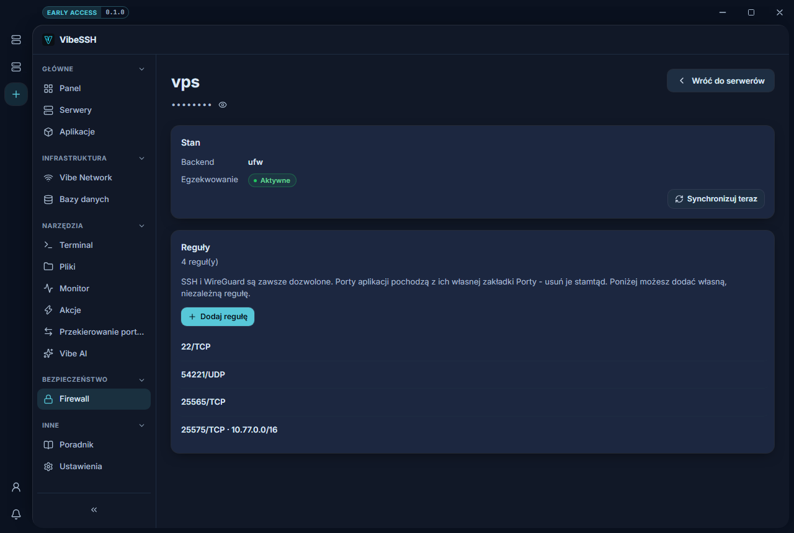

The firewall is where the access levels declared on application ports become real rules on the Node. Without it, "Vibe Network only" is a description of intent rather than a restriction.

## Where it is

The sidebar -> **Firewall**, once a server is chosen.

## Status

Two fields that have to be read together:

- **Backend** - which firewall was found on the Node (`ufw`). "none" means there is nothing to enforce rules with.
- **Enforcement** - whether that firewall is **active**. A backend present but inactive is the worst case: the rules are written and nothing is applying them.

The **Secure** button turns the firewall on - in an order that does not lock you out: the SSH rule is created before enforcement is enabled.

## Where rules come from

The list shows each rule's origin:

| Origin | Meaning |
| --- | --- |
| SSH (always allowed) | The port VibeSSH connects to the Node on. Always open - otherwise you lose access. |
| WireGuard (Vibe Network) | The private network's tunnel port. |
| `name` - port "..." | Derived from an application port and its access level. |
| Custom rule | One you added here. |

The first three kinds are **derived, not remembered**. A sync recomputes them from the current state of the applications and applies the whole set, removing what is no longer wanted. Editing them by hand on the Node therefore achieves nothing - the next sync restores the derived state.

## Custom rules

**Add rule** opens a port no application declared - while debugging, for instance.

| Field | Meaning |
| --- | --- |
| Label | A note to yourself, so next week you know what this was for. |
| Port | The port number (1-65535). |
| Protocol | TCP or UDP. |
| Restrict to a specific network | When ticked, the rule applies only to the range you give. |
| Source range (CIDR) | e.g. `203.0.113.0/24`. |

Restricting to a range is what separates "I opened a port for myself" from "I opened a port to the internet". If you know your address, use it.

## Sync now

Applies the derived rule set. **Sync firewall** on an application's Ports tab and a full Vibe Network sync do the same thing - three routes to one operation.

## Common mistakes

- **The port is open in VibeSSH and still unreachable** - VPS providers often have their own firewall in front of the machine. VibeSSH cannot see it and will not change it.
- **I enabled the firewall and lost SSH** - this should not happen, because the SSH rule is created first. But if you connect on a different port from the one configured in VibeSSH, that port is not covered by the guarantee.
- **I deleted an application's rule and it came back** - application rules are derived. To remove one for good, change that port's access level in the application.
