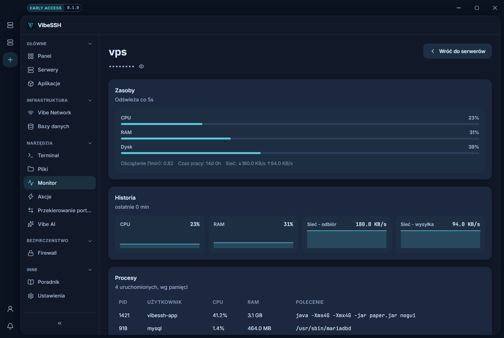

Monitor pokazuje, jak obciążony jest serwer i co na nim działa.

## Jak otworzyć

1. Otwórz **Monitor** w menu bocznym.
2. Wybierz serwer.

Strona odświeża się co 5 sekund.

## Co oznaczają wartości

| Wartość | Znaczenie | Kiedy jest problem |
| --- | --- | --- |
| **CPU** | Obciążenie procesora. | Stale powyżej 90%. |
| **RAM** | Zajęta pamięć. | Blisko 100% — serwer zacznie zwalniać albo zabijać procesy. |
| **Dysk** | Zajęte miejsce. | Powyżej 90% — brak miejsca zatrzyma aplikacje i backupy. |
| **Sieć** | Ruch przychodzący i wychodzący. | Nietypowo wysoki bez powodu. |

## Jak znaleźć, co obciąża serwer

1. Zjedź do sekcji **Procesy**.
2. Lista jest posortowana po zużyciu pamięci.
3. Sprawdź kolumny **CPU**, **RAM** i **Polecenie**.

## Jak sprawdzić, czy działa

- Paski CPU, RAM i Dysk pokazują wartości procentowe.
- Na liście **Procesy** widać uruchomione programy.

## Najczęstsze problemy

- **Wszędzie „zbieranie danych…"** — poczekaj na drugi odczyt. Procent CPU liczy się z różnicy dwóch pomiarów.
- **Wykresy zniknęły po wyjściu ze strony** — historia zbiera się tylko przy otwartej stronie i nie jest zapisywana.
- **RAM prawie w całości zajęty** — Linux używa wolnej pamięci na bufory i oddaje ją, gdy jest potrzebna. Patrz na pamięć zajętą przez procesy.

## Więcej informacji

Odświeżanie zatrzymuje się, gdy okno jest schowane, i rusza po powrocie. Każdy odczyt to połączenie z serwerem.
