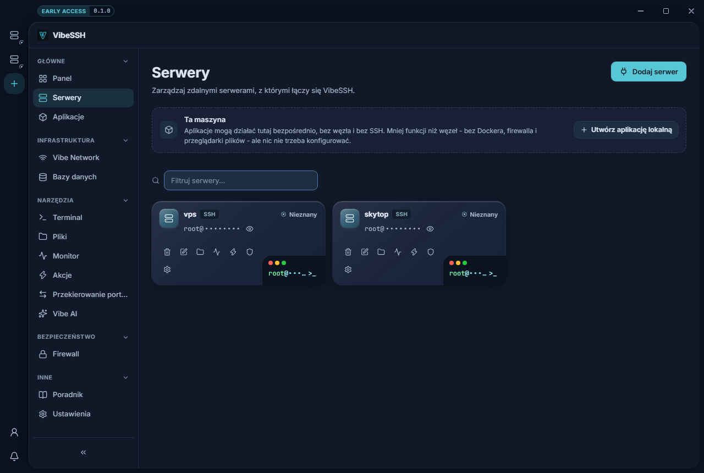

A Node is a server or VPS added to VibeSSH.

## How to add a Node

1. Open **Servers**.
2. Click **Add server**.
3. Leave the **Connect over SSH** tab selected.
4. **Name** - any name for your own use, e.g. `Production server`.
5. **Host** - the server's IP address, e.g. `203.0.113.10`.
6. **Port** - leave it at `22` unless your provider said otherwise.
7. **Username** - the account on the server, usually `root`.
8. **Authentication** - choose **Password** or **SSH key**.
9. For a password, type it. For a key, point at the key file on this computer.
10. Click **Test connection**. It should report **Connected successfully**.
11. Click **Save server**.

## How to set a Node up

1. On the server card, click the Node setup icon.
2. **Requirements** lists Docker, WireGuard and Firewall (ufw).
3. Next to anything reading **Missing**, click **Install automatically**.
4. Wait until it reads **Installed**.
5. Click **Check again** to refresh the state.

## How to remove a Node

1. Open **Servers**.
2. Click the bin icon on the server card.
3. Confirm.

Removing a Node from VibeSSH deletes nothing on the server itself.

## How to check it works

- The server reads **Online**.
- The card shows CPU, memory and uptime.
- **Terminal** opens a connection to the server.

## Common problems

- **Test connection fails** - check the IP address, port and username, and that the server is switched on.
- **The test passes but installing Docker fails** - the account has no `sudo`. Use `root`, or grant it.
- **A host key warning appears out of nowhere** - VibeSSH remembered this server's earlier key. If you rebuilt the server yourself, that is expected. If you did not, do not connect and find out why.

## More detail

Passwords and key passphrases go into the operating system's credential store, not into a configuration file. When editing a server, an empty password field means "keep the current one". The **Install the Vibe Agent** mode puts a service on the server instead of connecting over SSH; a Node in that mode shows no CPU or memory and has no terminal.
