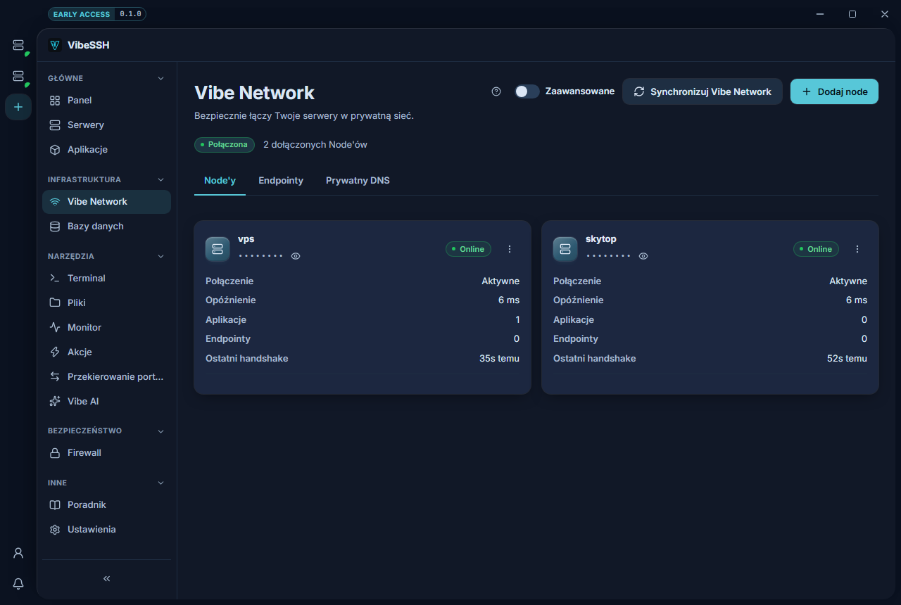

Vibe Network pozwala aplikacjom na różnych serwerach komunikować się prywatnie, bez wystawiania portów do internetu.

## Jak dodać Node do sieci

1. Otwórz **Vibe Network**.
2. Kliknij **Dodaj node**.
3. Wybierz serwer z listy.
4. Poczekaj, aż w wierszu **Połączenie** pojawi się **Aktywne**.
5. Powtórz dla pozostałych serwerów.

Node musi mieć zainstalowany WireGuard. Jeśli go brakuje, zainstaluj go w konfiguracji Node'a przyciskiem **Zainstaluj automatycznie**.

## Jak połączyć dwie aplikacje

1. Otwórz aplikację → zakładka **Porty**.
2. Zjedź do karty **Połączenia**.
3. W polu **Połącz z** wybierz drugą aplikację.
4. Kliknij **Połącz**.

Połączenie działa w obie strony i obowiązuje od razu.

## Jak sprawdzić, czy działa

- Obie karty Node mają **Połączenie: Aktywne**.
- Wiersz **Ostatni handshake** pokazuje czas liczony w sekundach lub minutach.
- Na karcie **Połączenia** druga aplikacja jest wypisana z adnotacją, pod jaką nazwą jest dostępna.

## Jak sprawdzić stan całej sieci

1. Kliknij **Synchronizuj Vibe Network**.
2. Pod przyciskiem pojawi się lista Node'ów z wynikiem.

## Znaczenie wiersza „Połączenie"

| Wartość | Co znaczy |
| --- | --- |
| **Aktywne** | Tunel działa. |
| **Nie zestawione** | Tunel jest podniesiony, ale nigdy nie było połączenia. |
| **Bez ruchu** | Połączenie było, ale dawno. |
| **Brak tunelu** | Na Node nie ma interfejsu sieci. |
| **Nieznane** | Nie udało się odczytać stanu. Powód jest w wierszu poniżej. |
| **Node nie odpowiada** | Serwer nie odpowiedział. |

## Najczęstsze problemy

- **Synchronizacja mówi „udane", a połączenie jest „Nie zestawione"** — sprawdź, czy dostawca VPS nie blokuje ruchu UDP. Vibe Network używa portu UDP `54221`.
- **Aplikacje nadal się nie widzą** — sam tunel łączy serwery, nie aplikacje. Dodaj połączenie na karcie **Połączenia**.
- **Brak tunelu** — na Node nie ma WireGuarda albo Node nie został jeszcze zsynchronizowany.

## Więcej informacji

Vibe Network używa WireGuarda. Klucz prywatny jest generowany na serwerze i nigdy go nie opuszcza. Zakładka **Prywatny DNS** nadaje serwerom nazwy w rodzaju `vps.vibe`, żeby konfiguracja mogła wskazywać nazwę zamiast adresu IP.
