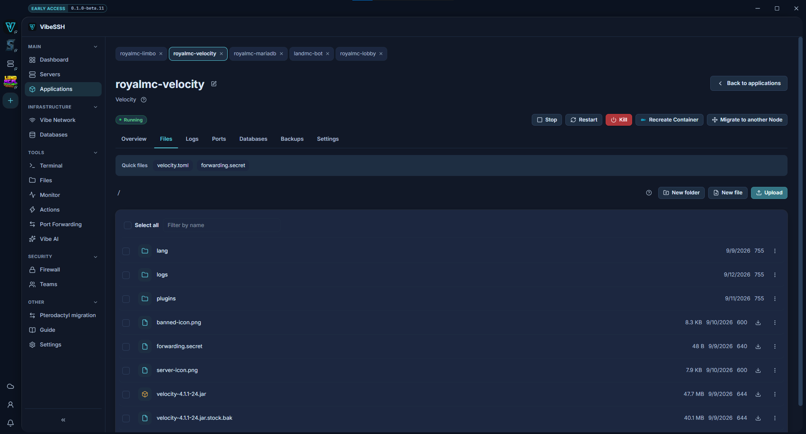

The **Files** tab shows an application's files: configuration, plugins, the world.

## How to browse

1. Open the application -> the **Files** tab.
2. Click a folder to enter it.
3. Click a name in the path above the list to go back up.
4. Use the **Filter** box to find a file by name.

## How to edit a file

1. Click the file's name.
2. Make your changes.
3. Click **Save** or press `Ctrl+S`.
4. Restart the application with **Restart**.

**Back up before saving**, ticked by default, keeps the previous version. You will find it under the history icon.

To find text in a file, click the magnifier or press `Ctrl+F`.

## How to upload a file

1. Click **Upload**.
2. Choose a file from your computer.
3. Wait for the transfer to finish.

## How to download a file from a link onto the server

Useful for plugins from Modrinth or a world from a release page: the Node downloads the file itself, so it never has to come to your computer first.

1. Go into the folder it belongs in, for example `plugins`.
2. Click **From link**.
3. Paste the **Link to the file**. The file name fills itself in, and you can change it.
4. Click **Download** and wait for **Downloaded**.

The link has to start with `http://` or `https://`, and the file can be up to 2 GB. A link with a login and password in it, or one pointing into the Node's internal network, will not work. A file with the same name in the folder is replaced.

## How to download a file

1. Click the download icon next to the file.
2. Choose where to save it.

## Other operations

Right-click a file:

- **Rename**
- **Move**
- **Copy**
- **Permissions**
- **Delete**
- **Extract** - for `.zip` files

Create new items with **New file** and **New folder**.

## How to check it works

- Saving shows a confirmation that the file was written.
- After a restart the application uses the new configuration.
- An uploaded file appears in the list.

## Common problems

- **I cannot save a YAML file** - a red bar above the editor names the line. Fix the error and saving unlocks.
- **I cannot see a file I uploaded another way** - enter the folder again to refresh the list.
- **The file will not open** - files over 1 MB do not open in the editor. Download it instead.

## More detail

Saving a `.yml` file is blocked while it has a syntax error, because such a file would stop the server from starting. Warnings do not block. The list shows at most 200 entries - in a larger folder, use **Filter**.
