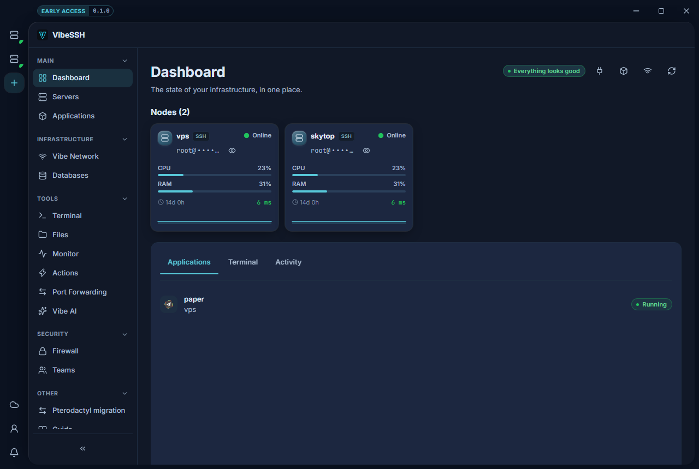

The dashboard shows the state of every server and application in one place.

## What is on it

1. **Header** - the overall state: **All good** or **Needs attention**.
2. **Nodes** - a tile per server with CPU, memory and uptime.
3. **Alerts** - a list of problems: a server offline, an application failing.
4. **Tasks** - things one click can do, such as synchronising a Node.

## How to look at one server

1. Click the server's tile.
2. **Applications**, **Terminal** and **Activity** tabs appear below.
3. Click **All Nodes** to go back to the overview.

## How to check it works

- The tiles show CPU and memory percentages.
- Servers read **Online**.
- The **Alerts** section is empty.

## Common problems

- **A server shows offline but is running** - VibeSSH could not connect. Check it in the **Servers** module.
- **A tile says "Collecting..."** - the second reading has not arrived. Wait a moment.
- **The metrics are frozen** - the window was hidden. Refreshing resumes when it returns.
