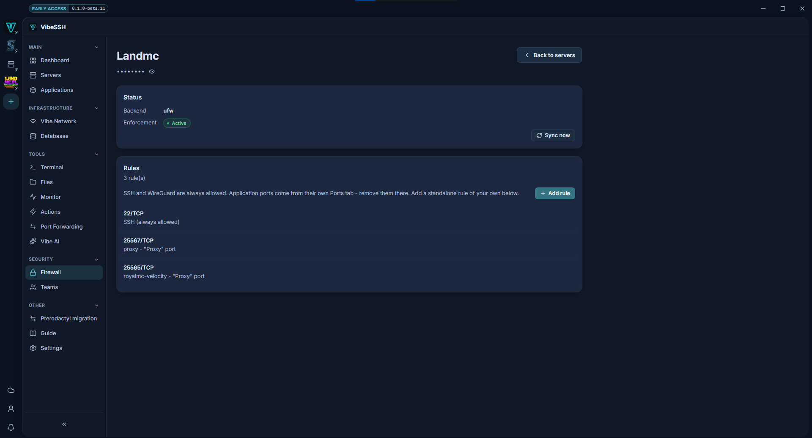

The firewall controls which of a Node's ports are reachable from the internet.

## How to turn the firewall on

1. Open **Firewall** and choose a server.
2. Look at the **Status** card.
3. If **Enforcement** reads **Inactive**, click **Secure**.
4. Wait until **Enforcement** reads **Active**.

The SSH rule is created before the firewall is enabled, so you will not lose access.

## How to see the rules

The **Rules** card lists every open port with where it came from:

| Origin | Meaning |
| --- | --- |
| **SSH (always allowed)** | The port VibeSSH connects on. |
| **WireGuard (Vibe Network)** | The private network's port. |
| application name - port | Derived from an application's port. |
| **Custom rule** | One you added. |

## How to add your own rule

1. Click **Add rule**.
2. **Label** - optional, e.g. `debugging`.
3. **Port** - the port number.
4. **Protocol** - `TCP` or `UDP`.
5. To restrict access, tick **Restrict to a specific network** and enter a **Source range (CIDR)**, e.g. `203.0.113.0/24`.
6. Save.

## How to remove a rule

1. Find a rule marked **Custom rule**.
2. Click the bin icon.
3. Confirm.

Application rules are not removed here. Change the port's **Network access** on the application's **Ports** tab.

## How to check it works

- **Backend** reads `ufw`.
- **Enforcement** reads **Active**.
- The list contains only the ports that should be open.

## Common problems

- **Backend: none** - the Node has no ufw. Install it from the Node setup screen.
- **Rules not enforced** - the firewall is installed but switched off. Click **Secure**.
- **The port is open in VibeSSH and still unreachable** - check your VPS provider's firewall.
- **A deleted application rule came back** - that is expected. Application rules are derived from the port settings.

## More detail

Back-end applications - databases, admin panels, RCON - should use **Vibe Network only**, not **Public**. Public is for the ports players or users connect to.
