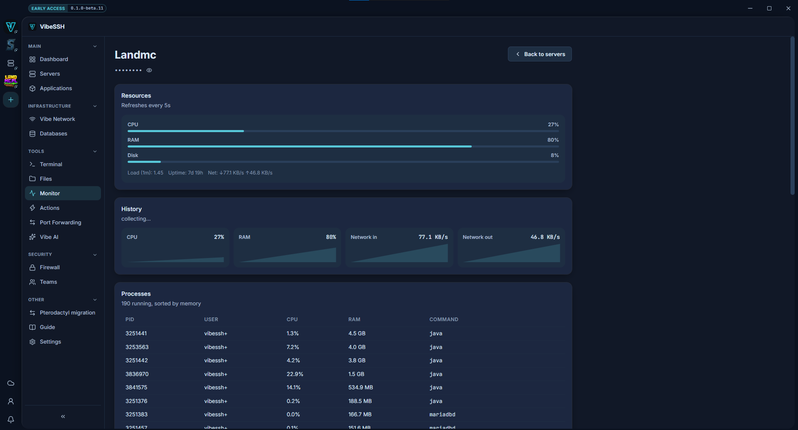

Monitor shows how loaded a server is and what is running on it.

## How to open it

1. Open **Monitor** in the sidebar.
2. Choose a server.

The page refreshes every 5 seconds.

## What the values mean

| Value | Meaning | When it is a problem |
| --- | --- | --- |
| **CPU** | Processor load. | Consistently above 90%. |
| **RAM** | Memory in use. | Near 100% - the server will slow down or kill processes. |
| **Disk** | Space used. | Above 90% - running out stops applications and backups. |
| **Network** | Traffic in and out. | Unusually high for no reason. |

## How to find what is loading the server

1. Scroll to the **Processes** section.
2. The list is sorted by memory use.
3. Read the **CPU**, **RAM** and **Command** columns.

## How to check it works

- The CPU, RAM and Disk bars show percentages.
- The **Processes** list shows running programs.

## Common problems

- **Everything says "collecting..."** - wait for the second reading. A CPU percentage is the difference between two measurements.
- **The charts vanished when I left the page** - history is collected only while the page is open and is not saved.
- **Memory is almost entirely used** - Linux spends free memory on buffers and gives it back when needed. Look at memory held by processes.

## More detail

Refreshing stops while the window is hidden and resumes when it returns. Each reading is a connection to the server.
