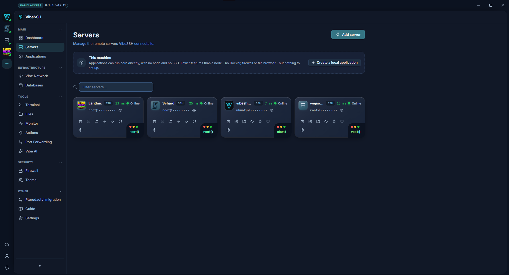
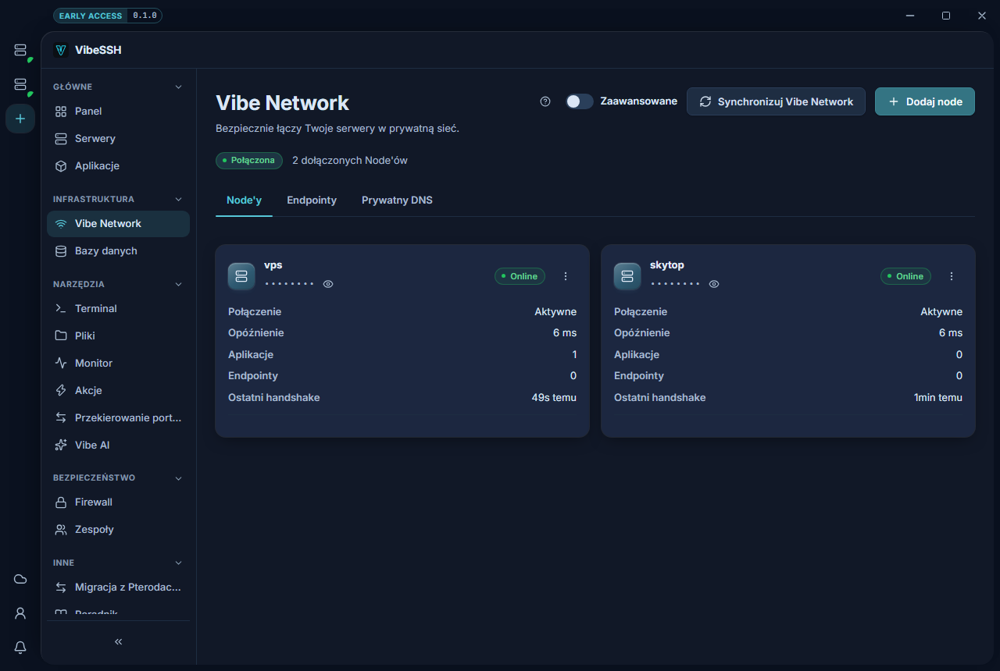
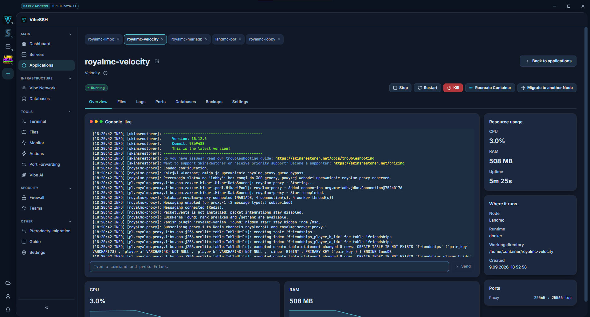
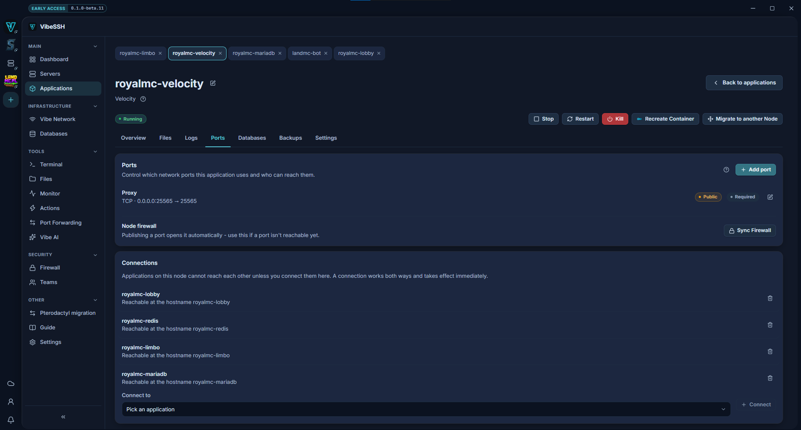
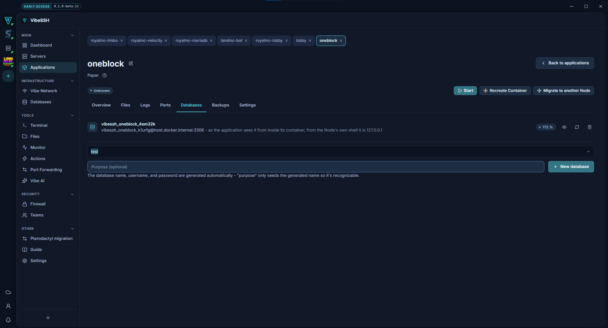

This page walks one path from beginning to end: **two servers, a private
network between them, and a database the second server can reach and the
internet cannot.**

It is the most common arrangement — a game server on one machine, its
database on another. Every step says what you should see, so you know whether
to carry on or go back.

About twenty minutes. You need two Linux servers and SSH access to both.

## Step 1. Add the first server

**Servers** → **Add server**. Enter the address, the user, and a key or
password. Press **Test connection** before saving.

The first connection shows the host key's fingerprint and asks whether to
accept it. That is normal — VibeSSH remembers it and will warn you if it ever
changes.



> **What you should see:** the server appears in the list with a green dot and
> **Online**. If it says **Offline**, check the SSH port and the firewall —
> reachability is a TCP connection, not a ping.

## Step 2. Add the second server

The same as step 1. Name them so you can tell them apart — say `game` and
`db`.

> **What you should see:** two servers listed, both **Online**.

## Step 3. Join them into a private network

**Vibe Network** → **Join network** on each server. Do both.

VibeSSH installs WireGuard if it is missing, generates the keys, and gives
each server an address in `10.77.0.0/16` — the first gets `10.77.0.1`, the
second `10.77.0.2`.

Then press **Sync network**. That is the moment the servers learn about each
other.



> **What you should see:** a `10.77.0.x` address on both, and a **last
> handshake** from a few seconds ago. A recent handshake means the two ends
> have exchanged traffic, which an assigned address on its own does not. It
> is not a test of DNS or of a particular port - step 7 checks those.

**If no handshake appears:** the sync reports a result per server, so you can
see which one failed. The usual cause is a blocked UDP port — check whether
your VPS provider filters UDP.

## Step 4. Create the database on the second server

**Applications** → **Create application**. Pick the `db` server, and under
**Start from a template** choose **MariaDB with a root password**.

The template fills in the variables the MariaDB image refuses to start
without. Without it the container is created and stops immediately, which was
the single most reported problem.



> **What you should see:** the application reads **Running**. If it says
> **Stopped**, open **Logs** — MariaDB says plainly what it is missing.

## Step 5. Open the database port to the private network only

In the database application: the **Ports** tab → **Add port**. Port `3306`,
TCP, and for visibility choose **Vibe Network only**.

This is the step the safety of the whole arrangement rests on. **Public**
means the entire internet.



> **What you should see:** two badges on the port — **Vibe Network only** and
> a green **Protected**. Green means this server has a firewall, it is
> enforcing, and the rule for this port really is applied.

> **If it is a red "Unprotected"**, the port is open to the world right now
> despite the visibility you chose. Press **Sync firewall** below the list. If
> it stays red, the server has no ufw or it is switched off; the note under
> the button says which.

## Step 6. Create a database for the application

The **Databases** tab of the application that will use it → **Create
database**. The name, user and password are generated for you.

Press the eye icon for the connection details. There are three separate
fields — **Host**, **Port** and **Address (host and port together)** —
because some configuration wants them apart and some wants them joined.



> **What you should see:** a row with the database name and its user. The
> password is shown on request and is not kept in the app's ordinary
> database.

## Step 7. Check that it works — and that it does not work from where it should not

Do not skip this one. Two checks.

**From the `game` server** (the **Terminal** tab), where `10.77.0.2` is the
`db` server's address from step 3:

```
nc -zv 10.77.0.2 3306
```

It should say **succeeded** or **open**.

**From your own computer**, against the `db` server's public address:

```
nc -zv PUBLIC_ADDRESS_OF_DB 3306
```

It should **time out**. That is the good outcome: it means the firewall is
dropping the packet silently.

> **If the second check connects**, the port is open to the world. Go back to
> step 5 and look at the badge.

> **If the first check times out as well**, the private network is not up. Go
> back to step 3 and look for the handshake.

## When half of it works

The usual combinations and what they mean:

| Symptom | What it means | Where to look |
| --- | --- | --- |
| Handshake present, `nc` from the other server times out | The network is up, the database's firewall is not letting you in | Step 5 — the badge on the port |
| Handshake present, the application cannot reach the database by name | Private DNS is not synced | **Vibe Network** → **Sync DNS** |
| Handshake missing on one server only | That server is not sending or accepting UDP | Your VPS provider's firewall, not VibeSSH |
| Everything green, the application still will not connect | The wrong address in the application's own configuration | **Databases** tab → connection details, the separate **Host** and **Port** fields |

## Where to go from here

The same arrangement extends without changing any of the rules: a third
server joins the network the same way, and the next database gets a port with
the same visibility.

If you want applications to find each other by name rather than by address,
see the **Vibe Network** page and its section on DNS aliases.
